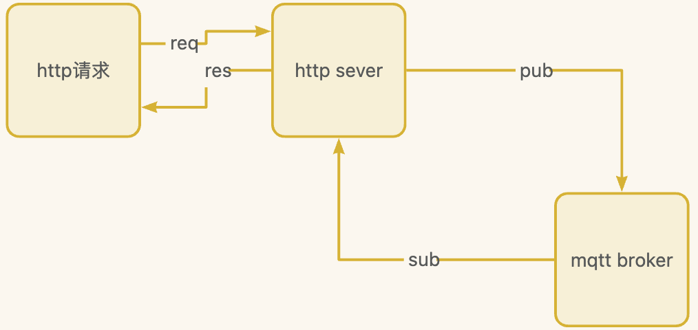

# http2mqtt

## 简介

使用http请求同步发送mqtt消息



## 接口文档

[在线接口文档参考](https://www.yuque.com/atorber/chatflow/acfdexfdkck4scxx#47ad9183)

## 快速开始

```ts
/* eslint-disable no-console */
import Koa from 'koa'
import Router from 'koa-router'
import bodyParser from 'koa-bodyparser'

import { Headers, Body, Http2Mqtt, ResponsePayload, Query } from '../src/http-to-mqtt.js'

// 运行npm i http2mqtt安装依赖
// import { Headers, Body, Http2Mqtt, ResponsePayload, Query } from 'http2mqtt'

const app = new Koa()
const router = new Router()

// 使用bodyParser中间件处理请求体
app.use(bodyParser())

router.post('/mqtt', async (ctx) => {
  // 将请求的上下文打印到控制台，方便调试
  console.debug(JSON.stringify(ctx))

  // 将请求头部的键转换为小写，以确保统一性
  const headers: Headers = Object.fromEntries(
    Object.entries(ctx.request.headers).map(([ key, value ]) => [ key.toLowerCase(), value ]),
  )  as unknown as Headers

  const body: Body = ctx.request.body as Body
  const query: Query = ctx.request.query as unknown as Query

  const ops = { body, headers, query }
  console.debug(JSON.stringify(ops))

  // 使用Http2Mqtt类处理请求
  const http2mqtt = new Http2Mqtt(ops)
  const res: ResponsePayload = await http2mqtt.pubMessage()

  // 设置响应的状态码和主体
  ctx.status = res.status
  ctx.body = res.body
})

// 使用路由中间件
app.use(router.routes()).use(router.allowedMethods())

// 从环境变量中获取端口号，如果没有定义，则默认为3000
const PORT = process.env['PORT'] || 3000

// 启动Koa服务器
app.listen(PORT, () => {
  console.log(`Server running on port ${PORT}`)
})

```

启动服务

```shell
npm run start:koa
```

## 请求示例

- 请求

```http
POST /mqtt?RequestTopic=my/topic&Convert={"transformed":$.original}
Headers:
  endpoint: mqtt.example.com
  username: myuser
  password: mypassword

Body:
{
  "original": "data"
}
```

- 响应

```json
{
  "error": "ok",
  "message": {
    "transformed": "data"
  }
}
```

## 百度云部署

```shell
cd examples/baidu-cfc
npm i
```

将index.js、package.json以及node_modules文件夹整理打包上传到百度云函数计算，设置http触发器

## 历史版本

### main v0.3.0

1. 固化参数

2. 百度云示例代码、koa示例代码等

3. 增加api接口说明

### v0.2.0

1. 构建流水线自动发包

### v0.0.1 (2023-8-31)

1. 初始化创建代码库及npm包

## Copyright & License

- Code released under the Apache-2.0 License
- Docs released under Creative Commons
