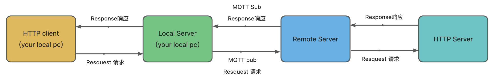

# HTTP Remote Invocation over MQTT

## 简介



HRIO-MQTT（HTTP Remote Invocation over MQTT）是一个利用MQTT协议远程调用HTTP API的代理网关。仿照RPC（远程过程调用）机制，包含一个本地客户端和一个远程服务器。

其工作流程如下：

1. 本地客户端将HTTP请求打包成MQTT消息后发出
2. 远程服务器接收这些消息，执行对应的HTTP请求，再将响应结果通过MQTT传回客户端

HRIO使本地程序能够调用任何部署在外部或本地服务器上的HTTP API，而不需要远程服务器具备公网IP，实现非公网HTTP API服务的远程访问。

使用场景：

- 本地WeChat机器人调用发送消息
- 远程调用本地电脑或服务器中运行的大模型服务
- 远程调用一切本地部署的HTTP API

## 快速开始

### 安装依赖

```
npm i
```

### 启动远程服务

在远程机器上启动服务，远程机器只需要能够访问外网，不需要外网IP

修改hrio/local-server/index.ts中的配置信息

```typescript
const ops = {
  http: {
    host: 'http://127.0.0.1', // 远程http服务的本地请求地址
    port: 19088, // 远程http服务的本地请求端口
  },
  mqtt: {
    endpoint:'broker.emqx.io', // MQTT服务的接入点
    port: '1883', // MQTT服务的端口号
    username: '', // MQTT用户名
    password: '', // MQTT密码
    requestTopic: 'requestTopic',  // 请求Topic
    responseTopic: 'responseTopic',  // 响应Topic
    secretkey: 'VmQAu7/aKEmt2iNIbg3+2HVKzpCRrdN1qelvTfK5gLo=',  // 加密密钥
  },
}
```

```shell
npm run remote
```

### 启动本地服务

在调用远程接口的机器上启动本地代理服务，请求本地API即可代理到远程服务器

```typescript
const ops: any = {
  http: {
    port: 19088, // 本地http服务的本地请求端口
    host: '', // 本地http服务的本地请求地址
  },
  mqtt: {
    endpoint: 'broker.emqx.io', // MQTT服务的接入点
    port: '1883', // MQTT服务的端口号
    username: '', // MQTT用户名
    password: '', // MQTT密码
    requestTopic: 'requestTopic',  // 请求Topic
    responseTopic: 'responseTopic',  // 响应Topic
    secretkey: 'VmQAu7/aKEmt2iNIbg3+2HVKzpCRrdN1qelvTfK5gLo=',  // 加密密钥
  },
}
```

```bash
npm run local
```

假设你在local-server和remote-server中启动的http服务端口一致，现在你可以直接在local-server所在的服务器上调用remote-server服务器中部署的API

## 历史版本

### v0.0.1

1. 初始化创建代码库
